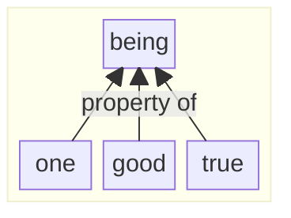
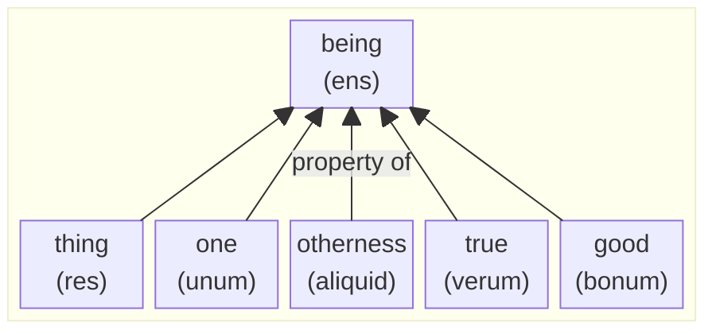
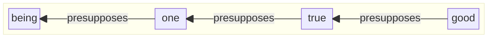
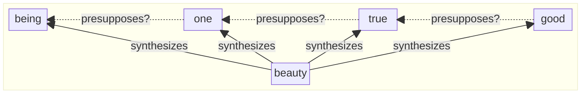
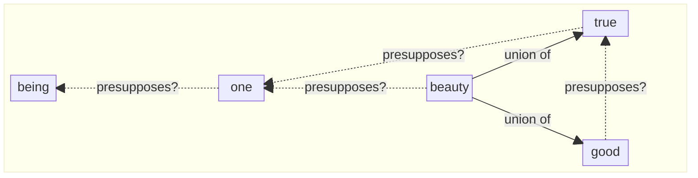
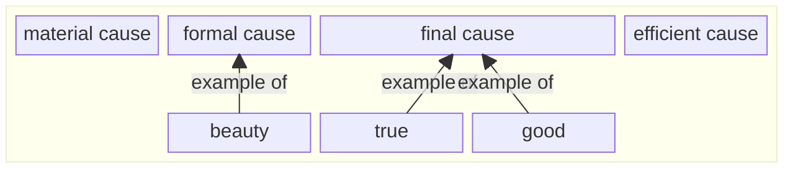
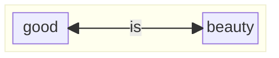
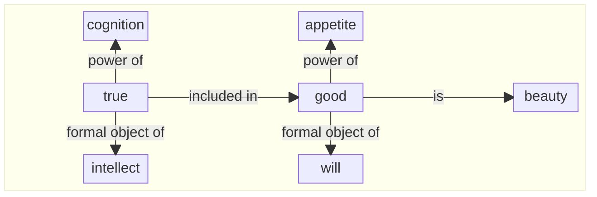

# transcendentals
Diagrams using Mermaid in Markdown

## Greek Philosophy

## Aquinas's 6 Transcendentals

## Aquinas's Ordo of the 4 Transcendentals

## Kovach's Attempted Addition of Beauty

## Czapiewski's Attempted Addition of Beauty

## Aquinas on Beauty, True, Good and the 4 Causes

## Greek's View on Good & Beauty

## Aertsen on Aquinas's View of True, Good, & Beautiful

